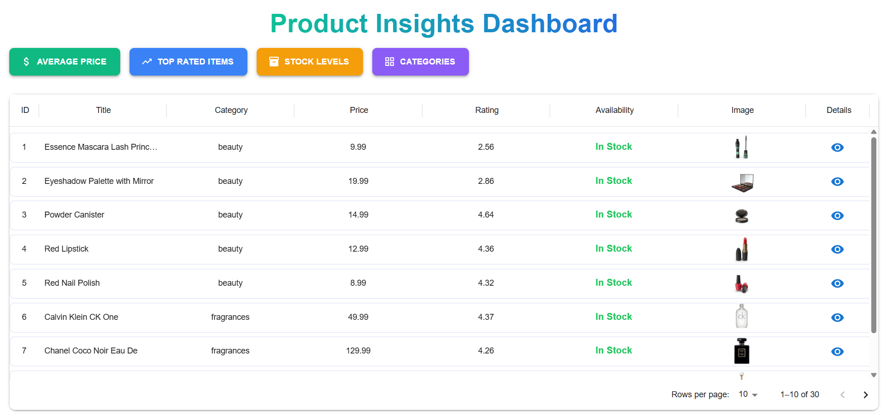
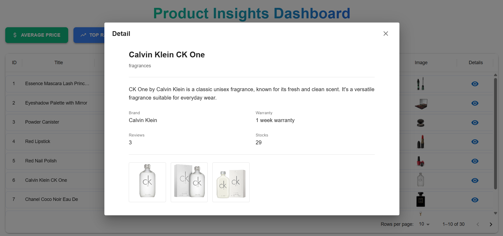
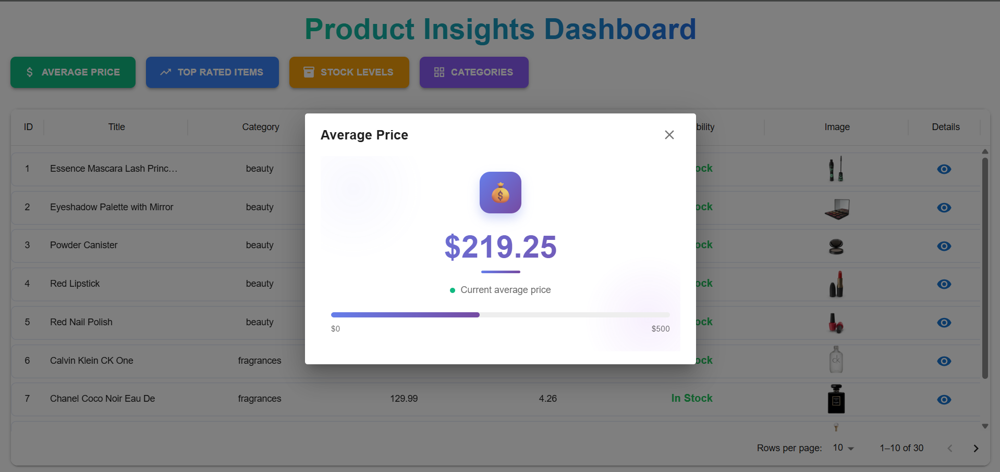
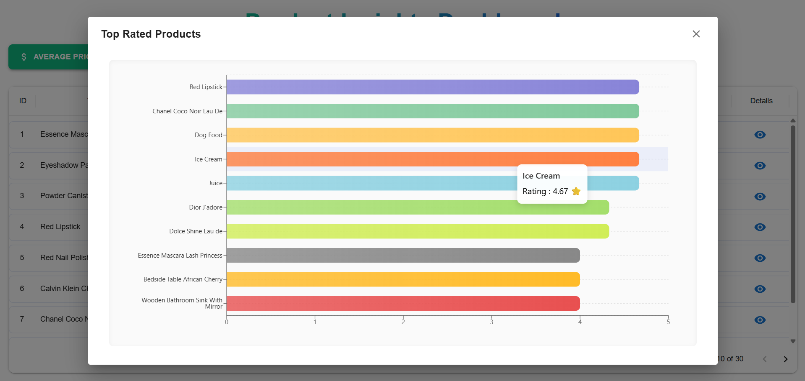
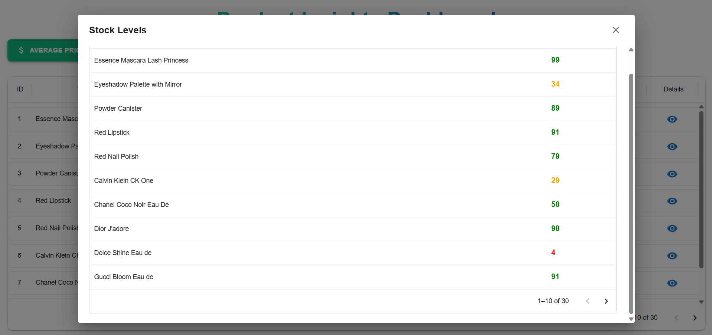
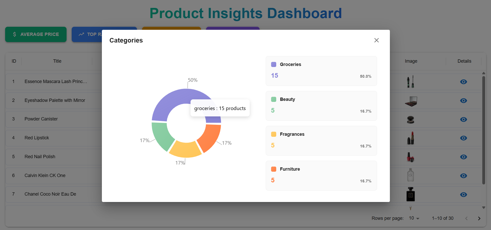

# Product Dashboard Application

A modern, responsive dashboard application built with Next.js and TypeScript for visualizing and managing product data. This application provides comprehensive insights into product analytics

## Getting Started

### Prerequisites

Before running the application, ensure you have:

- Node.js (version 20 or higher)
- npm, yarn, pnpm package manager
- Docker (optional, only if running with Docker)

### Running the project

1. Navigate to the root directory of the project:

```bash
cd /path/to/project
```

2. Install dependencies (if not already installed):

```bash
npm install
# or
yarn install
```

3. Run the development server:

```bash
npm run dev
# or
yarn dev
# or
pnpm dev
# or
bun dev
```

4. Open your browser and navigate to [http://localhost:3000](http://localhost:3000)

The application will automatically reload when you make changes to the code.

### Running with Docker

If you prefer to run the application using Docker:

1. **Start Docker Desktop**: Ensure Docker is running on your local machine. Open Docker Desktop application before proceeding.

2. **Build the Docker image**:

```bash
docker build -t product-dashboard .
```

3. **Run the Docker container**:

```bash
docker run -p 3000:3000 product-dashboard
```

4. **Access the application**: Open your browser and navigate to [http://localhost:3000](http://localhost:3000)

To stop the Docker container, press `Ctrl+C` in the terminal

## Application Overview

### 1. Main Dashboard

> **NOTE: Please run this application on your local machine to view the animations and interactive features for the best experience.**

The main dashboard serves as the central hub for all product data and analytics. It provides stakeholders with essential information at a glance.





**Table Interactions:**

- **Filtering**: Click the three dots (⋮) next to any column header to access filtering options
- **Sorting**: Click the arrow icon next to column headers to toggle between ascending and descending order
- **Pagination**: Use the pagination controls at the bottom to navigate through multiple pages of data
- **Detail View**: Use the eye icon under the detail column to access comprehensive information about individual products

### 2. Average Price Analytics

This section provides insights about the Average Price throughout your products.



### 3. Top Rated Products

Discover which products are performing best based on customer ratings and reviews.



### 4. Stocks Level

Monitor inventory levels across your entire product catalog to ensure optimal stock management.



### 5. Common Categories

Analyze product distribution across different categories to understand your inventory composition.



## Product & Technical Decisions

### 1. Product Decisions

#### 1.1 Key Metrics at the Top

Displaying **Average Price**, **Top Rated**, **Stock Levels**, and **Common Categories** provides stakeholders with a quick overview of critical business metrics.

**Reason**: Focus on metrics that are actionable for business users, enabling them to make informed decisions at a glance.

#### 1.2 Main Table for Detailed Information

Shows core product data including ID, title, category, price, rating, and images.

**Reason**: Provides transparency into the data behind the metrics, allowing stakeholders to validate trends and analyze patterns in detail.

#### 1.3 Detail View Modal

Clicking on a row or detail icon opens an in-depth view with comprehensive information (description, images, brand, warranty, shipping info, etc.).

**Reason**: Keeps the main table concise and scannable while still providing deep-dive capabilities for users who need detailed product information.

#### 1.4 Pagination, Sorting, and Filtering

Users can navigate large datasets easily, sort by any column, and filter data based on specific criteria.

**Reason**: Improves usability and scalability without overwhelming the UI. Enables users to focus on relevant information quickly.

#### 1.5 Interactive UI Elements

Charts and table controls are fully interactive with clickable headers for sorting and three-dot menu for advanced filtering.

**Reason**: Enhances user engagement and allows quick insights without leaving the page or loading new views.

### 2. Technical Decisions

#### 2.1 API Layer Architecture

Custom API routes in Next.js (`/api/products`, `/api/top-rated`, `/api/stock-levels`, etc.) for modular data handling.

**Benefits**:

- Separates frontend and backend logic cleanly
- Makes testing easier and more maintainable
- Allows for independent scaling of API functionality
- Simplifies future migrations or integrations

#### 2.2 Pagination Implementation

Implemented both server-side and client-side pagination to handle large datasets efficiently.

**Benefits**:

- Reduces bandwidth usage and API response times
- Prevents slow rendering on the frontend
- Improves overall user experience with faster load times
- Scalable for datasets with thousands of products

#### 2.3 File Structure & Organization

Proper folder and file organization following Next.js best practices with clear separation of concerns.

**Benefits**:

- Makes the codebase flexible and maintainable
- Easier for new developers to understand and contribute
- Reusable components are properly modularized
- Clear API route structure for backend logic

#### 2.4 Test Coverage

Added unit tests and integration tests to verify API data fetching.

**Benefits**:

- Ensures data is fetched and calculated accurately
- Prevents regressions when adding new features
- Improves confidence in code changes
- Documents expected behavior through test cases

#### 2.5 Docker Containerization

Application packaged with Dockerfile for running in containerized environments.

**Benefits**:

- Simplifies deployment across different environments
- Ensures application runs consistently across machines
- Ready for containerized CI/CD pipelines
- Simplifies onboarding for new developers

#### 2.6 CI/CD Pipelines

Configured GitHub Actions for automated builds, tests, and quality checks.

**Benefits**:

- Continuous integration ensures code quality before deployment
- Automated testing catches issues early
- Reduces manual deployment errors
- Streamlines development workflow

#### 2.7 Cached Dummy Data

Implemented caching for API responses to prevent repeated fetching of static/dummy data.

**Benefits**:

- Reduces load on API endpoints
- Speeds up development iterations
- Ensures consistent data during testing
- Prevents rate limiting issues with external APIs

#### 2.8 Responsive Design

Charts, tables, modals, and dashboard layout are fully responsive across all device sizes.

**Benefits**:

- Stakeholders can access dashboard from desktop, tablet, or mobile
- Consistent user experience across devices
- No separate mobile app needed
- Better accessibility for users on-the-go

#### 2.9 Material-UI (MUI) Integration

Used for DataGrid, responsive components, buttons, modals, and consistent styling.

**Benefits**:

- Pre-built components accelerate development
- Maintains consistent design language
- Provides accessibility features out of the box
- Robust table functionality

#### 2.10 Error Handling & Notifications

Snackbar alerts for failed API calls and comprehensive logging for backend routes.

**Benefits**:

- Provides immediate feedback to users
- Helps developers debug issues quickly
- Improves overall user experience
- Tracks errors for monitoring and improvement

#### 2.11 Sorting & Filtering Capabilities

All table columns support sorting and filtering.

**Benefits**:

- Stakeholders can easily explore data
- Focus on relevant products without UI complexity
- Consistent interaction patterns

## Current Limitations

### 1. Test Coverage

The test cases currently implemented focus primarily on important calculations and critical functionality. While core features are well-tested, there are still areas that need comprehensive coverage:

- Frontend component testing needs expansion
- Edge case scenarios require additional test coverage
- Integration tests between frontend and API layers could be more thorough
- End-to-end testing suite not yet implemented

### 2. Docker Configuration

The Dockerfile is currently at a basic functional level. To make it production-ready, improvements are needed:

- Production-optimized configurations
- Security hardening and vulnerability scanning
- Environment-specific configurations

### 3. CI/CD Pipeline Maturity

The CI/CD pipelines are at a foundational level and fulfill current development needs, but require enhancement for enterprise-grade deployment:

- Automated security scanning and vulnerability checks
- Performance testing integration
- Deployment rollback strategies
- More comprehensive automated testing gates

### 4. Frontend Limitations

Some edge cases and advanced scenarios need attention:

- UI components may not fully handle extreme edge cases (very large image arrays, exceptionally long product descriptions)
- Charts may require performance optimization for datasets with 10,000+ items

### 5. Data Persistence

Currently using cached dummy data. A production database implementation is needed for:

- Real-time data updates
- Data persistence across sessions
- Multi-user support

## Future Improvements

Given more time, the following enhancements would significantly improve the application:

### 1. Address Current Limitations

- Expand test coverage to include comprehensive frontend, integration tests
- Upgrade Dockerfile with production-grade optimizations and security measures
- Enhance CI/CD pipelines with advanced deployment strategies and monitoring
- Optimize frontend for all edge cases and extreme data scenarios

### 2. Edit Functionality

- Allow stakeholders to edit product information directly from the dashboard
- Implement inline editing in the data table for quick updates

### 3. Database Integration

- Implement proper database solution (Supabase or PostgreSQL)
- Real-time data synchronization capabilities

### 4. File Download Options

- Export filtered and sorted data to CSV format
- Generate PDF reports with charts and summaries
- Custom report builder for stakeholders and email delivery

### 5. Advanced Analytics

- Historical trend analysis with time-series charts
- Predictive analytics for inventory management
- Comparative analysis between product categories
- Real-time alerts for low stock or pricing anomalies

### 6. User Management & Permissions

- Role-based access control (admin, manager, viewer)
- User authentication and authorization
- Activity logs and audit trails
- Personalized dashboard preferences per user
- Team collaboration features

### 7. Performance Optimization

- Implement virtual scrolling for large tables
- Code splitting and lazy loading for faster initial load
- Image lazy loading and progressive enhancement
- CDN integration for static assets

### 8. Integration Capabilities

- REST API for third-party integrations
- Webhook support for real-time notifications
- Import data from external sources (CSV, API)
- Integration with inventory management systems
- E-commerce platform synchronization

---

This project uses [`next/font`](https://nextjs.org/docs/app/building-your-application/optimizing/fonts) to automatically optimize and load [Geist](https://vercel.com/font), a new font family for Vercel.

## Learn More

To learn more about Next.js, take a look at the following resources:

- [Next.js Documentation](https://nextjs.org/docs) - learn about Next.js features and API.
- [Learn Next.js](https://nextjs.org/learn) - an interactive Next.js tutorial.

You can check out [the Next.js GitHub repository](https://github.com/vercel/next.js) - your feedback and contributions are welcome!

## Deploy on Vercel

The easiest way to deploy your Next.js app is to use the [Vercel Platform](https://vercel.com/new?utm_medium=default-template&filter=next.js&utm_source=create-next-app&utm_campaign=create-next-app-readme) from the creators of Next.js.

Check out our [Next.js deployment documentation](https://nextjs.org/docs/app/building-your-application/deploying) for more details.

This is a [Next.js](https://nextjs.org) project bootstrapped with [`create-next-app`](https://nextjs.org/docs/app/api-reference/cli/create-next-app).
